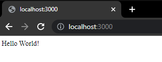
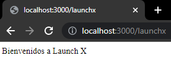
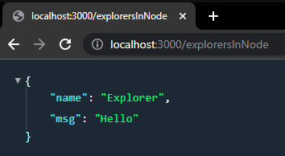
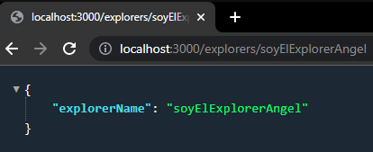
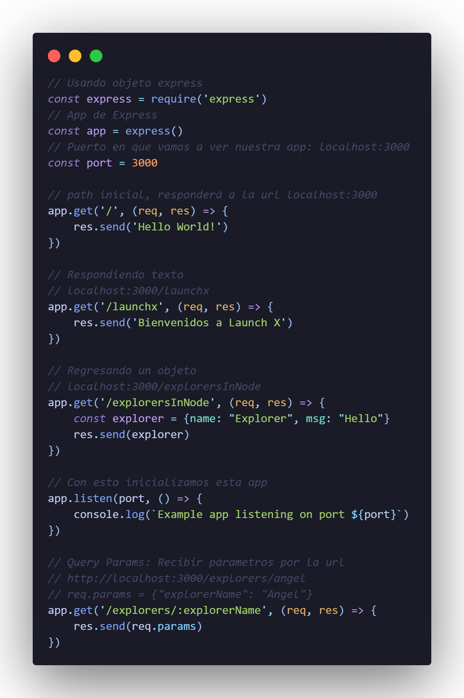

# Mi primer server con Express.js
## Creación del primer server

1. Crear un proyecto nuevo llamado *express_basic*.
2. Ejecutar el comando *`npm init`*.
3. Instalar la dependencia express con el comando *`npm install express --save`*.


Se crea un archivo app.js en la raíz del proyecto donde haremos todo el proceso para la nueva aplicación.

```
// Usando objeto express
const express = require('express')
// App de Express
const app = express()
// Puerto en que vamos a ver nuestra app: localhost:3000
const port = 3000

// path inicial, responderá a la url localhost:3000
app.get('/', (req, res) => {
    res.send('Hello World!')
})

// Con esto inicializamos esta app
app.listen(port, () => {
    console.log(`Example app listening on port ${port}`)
})
```

Para ejecutar la aplicación en el navegado ejecutamos el siguiente comando *`node app.js`* y abrimos el navegador de preferencia y escribimos *`localhost:3000`*.

 

### Agregar nueva ruta

Agregar una nueva ruta para cambiar la vista a través de la url *localhost:3000/launchx*.

````
// Usando objeto express
const express = require('express')
// App de Express
const app = express()
// Puerto en que vamos a ver nuestra app: localhost:3000
const port = 3000

// path inicial, responderá a la url localhost:3000
app.get('/', (req, res) => {
    res.send('Hello World!')
})

// Respondiendo texto
// localhost:3000/launchx
app.get('/launchx', (req, res) => {
    res.send('Bienvenidos a Launch X')
})
````

Verificar que se puede acceder a la ruta *localhost:3000/launchx*.

 

### Agregar nueva ruta para regresar un objeto

```
// Regresando un objeto
// localhost:3000/explorersInNode
app.get('/explorersInNode', (req, res) => {
    const explorer = {name: "Explorer", msg: "Hello"}
    res.send(explorer)
})
```

A continuación, entramos a la url *`localhost:3000/explorersInNode`*.

 

### Agregar nueva ruta que reciba un Query Params

Se agregará una nueva ruta que recibirá un parámetro: /explorers/:explorerName que indicará que :explorerName será un valor por la url.
El objeto req contiene la propiedad params, esta propiedad contiene los Query Params (parámetros) enviados por la url. (req.params).

```
// Query Params: Recibir párametros por la url
// http://localhost:3000/explorers/angel
// req.params = {"explorerName": "Angel"}
app.get('/explorers/:explorerName', (req, res) => {
    res.send(req.params)
})
```

Tenemos que verificar entrando en la url *localhost:3000/explorers/soyElExplorerAngel*.




**Archivo app.js**
